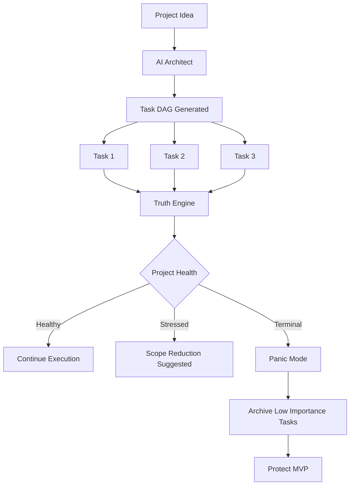

# 🚀 Scrumb — The Guaranteed-Finish Engine

**Scrumb** isn't a project management tool.  
It's a **project execution machine**.

Traditional tools help you *track work*.  
Scrumb ensures you **actually finish the project**.

It uses **AI-driven execution math**, **dependency graphs**, and **ruthless scope control** to guarantee deadlines are met.

🌐 **Live Demo:** https://www.scrumb.in/

---

# 🎯 The Philosophy

Most projects fail because of:

- Scope creep
- Hidden dependencies
- Team bottlenecks
- Lack of accountability

Scrumb solves this with three principles:

1. **Math over opinions**
2. **Dependencies over to-do lists**
3. **Execution over planning**

---

# ⚙️ Tech Stack

### Backend
- Django
- Django REST Framework (DRF)

### AI
- Gemini 1.5 Pro  
  - Task Architect  
  - Scope Executioner

### IDE Integration
- JetBrains Plugin (Sohal's Realm)

### Database
- PostgreSQL  
- Supports **Dependency DAG storage**

---

# 🧠 Core Systems

## 1️⃣ The Architect (AI Task Generation)

The Architect converts a project description into a **Directed Acyclic Graph (DAG)** of tasks.

### Vertical Structure

Parent → Subtask hierarchy

Example:

```
Build Authentication
├── Login API  
├── Signup API  
└── Password Reset  
```

### Horizontal Dependencies

Tasks can depend on others.

```
Frontend Dashboard  
↑  
Backend API  
↑  
Database Schema  
```

Tasks remain **LOCKED** until prerequisites are completed.

This prevents teams from starting work **out of order**.

---

## 2️⃣ The Truth Engine (Project Health)

Scrumb continuously calculates **real project health** using:

### Importance-Weighted Velocity

Instead of counting completed tasks, Scrumb measures:

- Task importance
- Completion velocity
- Remaining workload
- Time until **guarantee_date**

### Health States

🟢 Healthy – On track to hit the deadline  
🟡 Stressed – Scope reduction recommended  
🔴 Terminal – Panic Mode imminent  

---

## 3️⃣ Panic Mode (The Nuclear Option)

When the math proves the project **cannot finish on time**, Scrumb activates:

## 🔥 Panic Mode

The AI recursively archives **low-importance tasks** to protect the **core MVP**.

Example:

Before Panic Mode

```
MVP  
├─ Auth  
├─ Dashboard  
├─ AI Recommender  
├─ Notifications  
└─ Analytics  
```

After Panic Mode

```
MVP  
├─ Auth  
└─ Dashboard  
```

Everything else is archived.

The result:

**The project still ships.**

---

## 4️⃣ Accountability Engine (The Shame Report)

Every day Scrumb runs an automated audit.

It identifies the **Critical Path Bottleneck**:

The person whose stalled task blocks the most downstream work.

Example:

```
🚨 CRITICAL PATH BOTTLENECK  

Developer: Sohal  
Blocked Tasks: 6  
Impact: Entire Frontend Team  
```

If one person blocks the graph…

**The entire project slows down.**

---

# 🧩 Architecture



---

# 📡 API Quick Reference

### Create Project + AI Task Tree

```
POST /api/projects/
```

Creates a project and generates the **AI dependency DAG**.

---

### Project Health Stats

```
GET /api/projects/{id}/
```

Returns:

* Completion percentage
* Project health
* Velocity
* Critical path

---

### Update Task Status

```
PATCH /api/tasks/{id}/
```

Rules enforced automatically:

* Cannot start if dependencies aren't finished
* Cannot finish if subtasks remain

---

### Trigger Panic Mode

```
POST /api/projects/{id}/panic_mode/
```

Executes **recursive scope reduction**.

---

# 🚦 Rules of the Game

Scrumb enforces execution discipline.

### ❌ No Cheating

You **cannot mark a parent task done** if subtasks remain open.

### ❌ No Skipping

You **cannot start a task** until its dependencies are completed.

### ⚠️ Push or Die

If the Git log shows **no activity**:

* Velocity drops
* Health declines
* AI starts **cutting features**

---

# 🧮 How Scrumb Guarantees Deadlines

Scrumb models project completion using:

```
Projected Completion Time = Remaining Work / Importance Weighted Velocity
```

If:

```
Projected Completion Time > Time Remaining
```

The system automatically triggers:

1. Scope Reduction
2. Task Reprioritization
3. Panic Mode

This ensures **the MVP always ships** before the deadline.

---

# 🌍 Live Deployment

Try Scrumb here:

👉 [https://www.scrumb.in/](https://www.scrumb.in/)

---

# 👨‍💻 Author

**Naman Agrawal**

GitHub: [https://github.com/TheCodeKage](https://github.com/TheCodeKage)
